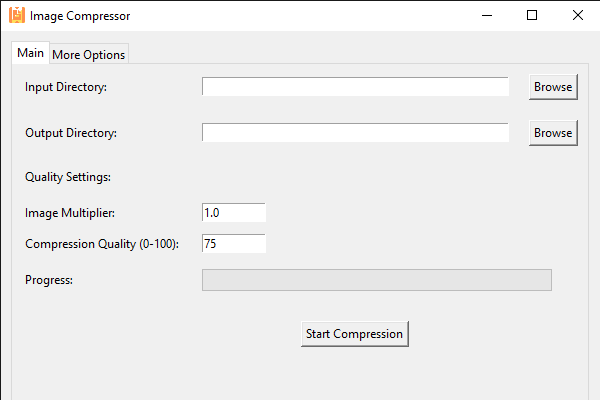
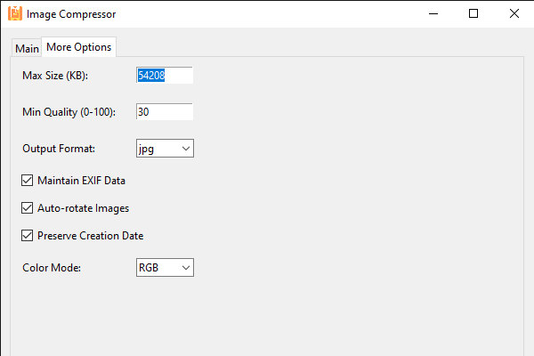

# Image Compressor

A modern, user-friendly desktop application for batch compressing and resizing images with customizable quality settings.

 <!-- Add a screenshot of the main application window -->

## Features

- Batch image compression with customizable quality settings
- Support for JPG, PNG, WEBP, and BMP input formats
- Adjustable compression quality and image size multiplier
- Maximum file size limit with adaptive quality reduction
- Modern, tabbed interface with dark mode support
- Progress tracking with visual feedback
- Advanced options including:
  - Output format selection (JPG, PNG, WEBP)
  - EXIF data preservation
  - Auto-rotation based on EXIF data
  - Creation date preservation
  - Color mode selection (RGB/Grayscale)

 <!-- Add a screenshot of the advanced options tab -->

## Installation

1. Clone the repository:
```bash
git clone https://github.com/IrishEgie/compress_images_py
cd compress_images_py
```

2. Install dependencies:
```bash
pip install pillow tkinter
```

3. Run the application:
```bash
python image_compressor.py
```

## Usage

1. Launch the application
2. Select input directory containing images
3. Choose output directory for compressed images
4. Adjust compression settings:
   - Image multiplier (resize factor)
   - Compression quality (0-100)
   - Maximum file size (KB)
   - Minimum quality threshold
5. Click "Start Compression" to begin processing


## Requirements

- Python 3.6+
- Pillow (PIL)
- tkinter (usually comes with Python)

## Contributing

Contributions are welcome! Please feel free to submit a Pull Request.

## License

This project is licensed under the MIT License - see the [LICENSE](LICENSE) file for details.
